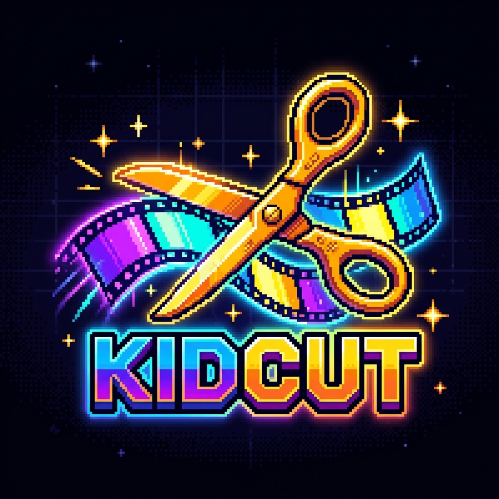

# ✂️ KidCut - 8-Bit Pixel Video Studio

<p align="center">
  
  <br>
  <b>Editor de video multicanal estilo CapCut con estética retro Pixel Art de 8 bits</b>
  <br>
  <i>Ultra-ligero, determinista cuadro por cuadro, con 100 efectos retro y ejecutable nativo para Windows.</i>
</p>

---

## 🌟 Características Principales

- **🎮 Estética Retro 8-Bits Auténtica**: Tipografías arcade (`Press Start 2P`, `Silkscreen`, `VT323`), interfaz pixelada, efectos CRT Scanlines y pantalla de carga retro (*"INSERT COIN"*).
- **🕹️ 100 Efectos y Filtros Únicos**:
  - **Paletas Retro (15)**: Game Boy, NES/Famicom, SNES 16-Bit, Mega Drive, Commodore 64, ZX Spectrum, CGA, EGA, Atari 2600, Cyberpunk, Vaporwave, Matrix, Ámbar CRT.
  - **CRT & Pantallas (15)**: Scanlines, Tubo Curvo, Fósforo Glow, Trinitron RGB, Intercalado, Ruido TV, Jitter VHS, Glitch RGB, Bad Tracking, HUDs VHS y Low Batt.
  - **Pixelación & Mosaico (15)**: Pixelado Micro a Ultra, Dithering Bayer y Floyd-Steinberg, Mosaico Hexagonal, Ladrillos, Panel LED, Punto de Cruz, ASCII Art.
  - **Color & Cine (20)**: Film Noir, Sepia, Technicolor, Kodachrome, Polaroid, Bleach Bypass, X-Pro, Cálido 70s, Sci-Fi, Duotonos, Térmica FLIR, Visión Nocturna, Rayos X, Solarización, Posterizado.
  - **Óptica & Lentes (15)**: Ojo de Pez, Distorsión de Barril, Ondas Acuáticas, Vórtice, Espejos, Caleidoscopios, Zoom Blur, Motion Blur, Tilt-Shift, Viñetas, Líneas Manga.
  - **Atmósfera & Luz (10)**: Parpadeo Neón, Luz Estroboscópica, Lluvia y Nieve Pixel, Chispas, Polvo de Película, God Rays, Niebla, Confeti, Starfield Warp.
  - **HUDs & Overlays (10)**: INSERT COIN, 1UP Score, Corazones de Vida, Barra de Jefe, Retícula Cyber, Gabinete Arcade, Game Boy, Temporizador 99, Alerta Peligro, Perforaciones 35mm.
- **🖱️ Manipulación en Pantalla**: Mueve y escala stickers, texto e imágenes directamente en el lienzo de previsualización con manijas de esquina.
- **🔊 Preservación de Audio Original**: Extracción y decodificación automática del audio original de videos importados (MP4/WebM) sincronizado en la línea de tiempo.
- **🎬 Edición Multicanal**: Pistas de video (V1, V2...) y pistas de audio (A1, A2...) con herramientas de corte rápido (`Split / B`), recorte (`Trim`), duplicación y snapping magnético.
- **⚡ Transiciones y Animaciones**: Disolvencia Pixel, Cortinillas H/V, Círculo Iris, Persianas, Glitch Wipe, TV Turn-Off; y animaciones de texto (Blink, Typewriter, Wave, Glitch, Rainbow, Pop).
- **💾 Exportación HD Determinista**: Exporta en 1080p, 720p, 480p o 4K (16:9, 9:16, 1:1, 4:5) en **WebM**, **MP4**, **WAV** y **GIF Animado LZW** sin pérdida de cuadros en equipos de bajos recursos.
- **🪟 Ejecutable para Windows (`KidCut.exe`)**: Aplicación de escritorio nativa de 127 KB con icono arcade y servidor local integrado.

---

## 🚀 Inicio Rápido

### Opción 1: Ejecutable de Windows (Recomendado)
Haz doble clic directamente sobre **`KidCut.exe`** en la carpeta raíz para abrir la aplicación de escritorio.

### Opción 2: Lanzador por Lotes
Haz doble clic en **`Launch-KidCut.bat`**.

### Opción 3: Desarrollo Web (Node.js)
```bash
# Instalar dependencias
npm install

# Iniciar servidor de desarrollo
npm run dev

# Compilar para producción
npm run build
```

---

## 📁 Estructura del Proyecto

```
kidcut/
├── KidCut.exe              # Ejecutable nativo autónomo de Windows (127 KB)
├── Launch-KidCut.bat        # Lanzador batch de Windows
├── Program.cs              # Código fuente C# del ejecutable de escritorio
├── icon.ico / icon.png     # Icono oficial pixel art
├── public/                 # Recursos gráficos y logo
│   └── logo.png
├── src/
│   ├── engine/
│   │   ├── AudioEngine.js        # Mezclador Web Audio y sintetizador chiptune
│   │   ├── Compositor.js         # Motor de composición sobre canvas
│   │   ├── EffectsDatabase.js    # Catálogo estructurado de 100 efectos
│   │   ├── EffectsEngine.js      # Algoritmos y shaders de 100 efectos
│   │   ├── Exporter.js           # Exportador determinista HD
│   │   ├── GifEncoder.js         # Codificador GIF89a LZW puro
│   │   ├── TimelineEngine.js     # Gestión de estado multicanal y playback
│   │   ├── TransitionsEngine.js  # Transiciones retro 8-bit
│   │   └── types.js              # Modelos y constantes
│   ├── ui/
│   │   ├── AssetLibrary.js       # Panel de medios, 100 efectos, texto y stickers
│   │   ├── ExportModal.js        # Ventana retro de exportación
│   │   ├── HeaderBar.js          # Barra superior y aspect ratio
│   │   ├── InspectorView.js      # Inspector de propiedades y filtros
│   │   ├── PreviewCanvas.js      # Lienzo con manipulación interactiva
│   │   ├── SplashScreen.js       # Pantalla de carga arcade
│   │   └── TimelineView.js       # Línea de tiempo multicanal interactiva
│   ├── main.js                   # Inicializador general
│   └── style.css                 # Sistema de diseño retro 8-bit
├── index.html
└── package.json
```

---

## 📜 Licencia
MIT License - Creado con ❤️ para creadores retro y amantes del Pixel Art.
